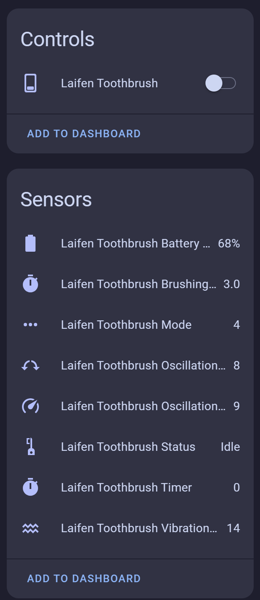

# Laifen

**Custom Integration for Laifen Devices in Home Assistant**

This custom integration adds support for Laifen BLE toothbrushes, such as the **Laifen Wave**, in Home Assistant.

## Features

Once configured, the integration provides the following entities:

### Sensors

- **Status Sensor** – Shows the current device status (e.g., idle, brushing)
- **Selected Mode** – Displays the active brushing mode
- **Vibration Strength** – Intensity level of the current mode
- **Oscillation Speed** – Speed of oscillation for the current mode
- **Oscillation Range** – Oscillation angle range of the current mode
- **Battery Level** – Current battery charge of the toothbrush
- **Brushing Time Setting** – The configured duration for brushing before auto shutoff
- **Active Timer** – Displays how long the toothbrush has been running during a session

### Switches

- **Power Control** – Allows turning the device on or off via Home Assistant

## Device Discovery

The integration automatically scans for nearby Laifen devices over Bluetooth.  
> ⚠️ **Important:** Ensure the Laifen Wave is **awake and powered on** during the initial pairing process, or it may not be detected.

## Via HACS (Recommended)

1. In Home Assistant, go to **HACS**.
2. New custom repository.
3. Add https://github.com/UrbanTechIO/Laifen
4. Pick Integration.
5. Install
6. Restart Home Assistant.

Then, add the integration via:

**Settings > Devices & Services > Add Integration > Laifen**

### Manual Installation

1. Download the contents of this repository.
2. Copy the `laifen_ble` folder into your `custom_components` directory:
3. Restart Home Assistant.
4. Go to **Settings > Devices & Services > Add Integration > Laifen**

## Notes

- The integration stores the last known state of the device.
- Entities will appear after reboot even if the brush is asleep or out of range.
- Full functionality resumes once the toothbrush is detected again via Bluetooth.

## Links

- GitHub: [UrbanTechIO/Laifen](https://github.com/UrbanTechIO/Laifen)

