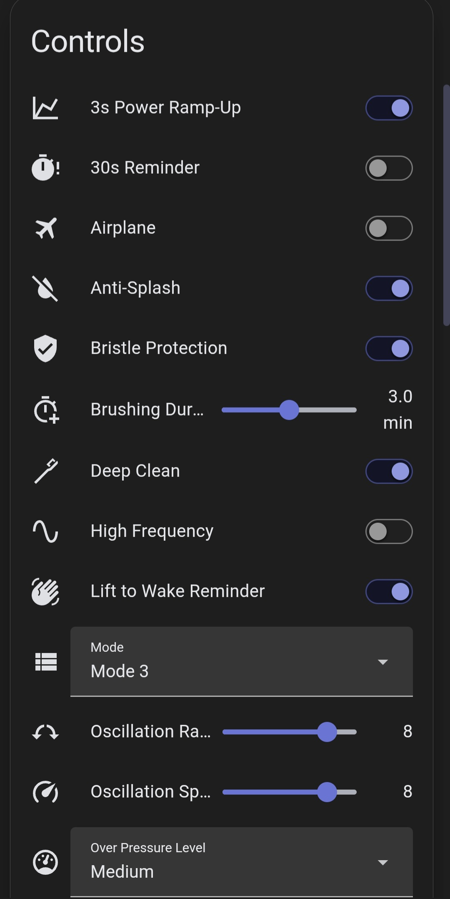
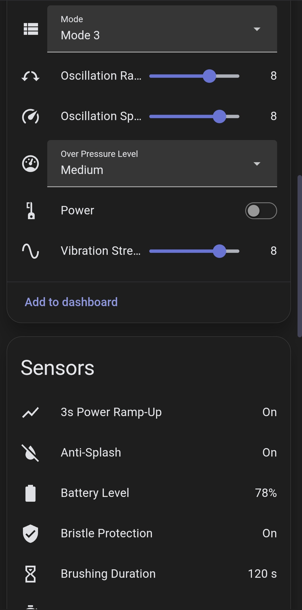
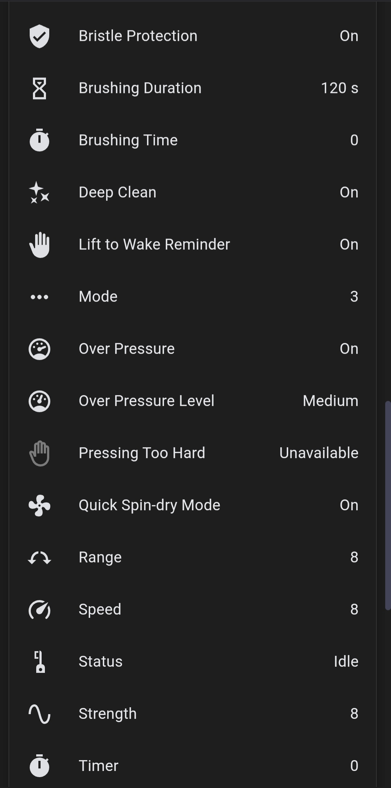
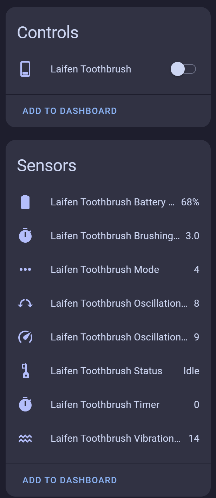

# Laifen

**Custom Integration for Laifen Devices in Home Assistant**

This custom integration adds support for Laifen BLE toothbrushes — the **Laifen Wave** and the **Laifen Wave Pro** — in Home Assistant.

## Features

Once configured, the integration provides the following entities. Entities marked **(Wave Pro)** are only created for the Wave Pro.

### Sensors

- **Status** – Shows the current device status (e.g., idle, brushing)
- **Mode** – Displays the active brushing mode
- **Strength / Speed / Range** – Active vibration strength, oscillation speed, and oscillation range of the current mode
- **Battery Level** – Current battery charge of the toothbrush
- **Brushing Time** – The configured duration for brushing before auto shutoff
- **Timer** – Displays how long the toothbrush has been running during a session
- **Brushing Duration** – Configured session length **(Wave Pro)**
- **Over Pressure Level** – Current pressure sensitivity setting **(Wave Pro)**

### Controls

- **Mode** – Select the brushing mode (Mode 1–3, plus Mode 4 when High Frequency is enabled)
- **Vibration Strength** – 1–10 per mode (up to 20 in Mode 4)
- **Oscillation Speed** – 1–10 per mode
- **Oscillation Range** – 1–10 per mode
- **Over Pressure Level** – Pressure sensitivity: Light / Medium / Hard **(Wave Pro)**
- **Brushing Duration Adjustment** – Session length in minutes **(Wave Pro)**

### Switches

- **Power** – Turn the brush motor on or off
- **High Frequency** – Enables Mode 4 and extends strength range
- **Airplane** – Locks the physical button for travel
- **30s Reminder** – 30-second brushing pacer
- **Deep Clean** – Deep clean mode (must be off to use High Frequency) **(Wave Pro)**
- **Anti-Splash** **(Wave Pro)**
- **3s Power Ramp-Up** – Gentle power ramp on start **(Wave Pro)**
- **Bristle Protection** **(Wave Pro)**
- **Lift to Wake Reminder** **(Wave Pro)**

### Binary Sensors

- **Connection** – BLE connection status
- **Pressing Too Hard** – Real-time over-pressure warning while brushing **(Wave Pro)**
- **Feature status** – Read-only state of Deep Clean, Anti-Splash, 3s Power Ramp-Up, Quick Spin-dry Mode, Over Pressure, Bristle Protection, and Lift to Wake Reminder **(Wave Pro)**

## Companion Dashboard Card

There is an official companion Lovelace card for this integration: **[Laifen Card](https://github.com/UrbanTechIO/laifen-card)**.

A frosted-glass card with a live brushing timer ring, mode/strength/speed/range controls, feature toggles, and Wave Pro extras (pressure sensitivity, duration, over-pressure warning) — with a full UI editor and automatic entity discovery. Install it via HACS by adding `https://github.com/UrbanTechIO/laifen-card` as a custom repository (category **Dashboard**).

  

## Device Discovery

The integration automatically scans for nearby Laifen devices over Bluetooth.  
> ⚠️ **Important:** Ensure the Laifen Wave is **awake** during the initial pairing process, or it may not be detected.

## Via HACS (Recommended)

1. In Home Assistant, go to **HACS**.
2. New custom repository.
3. Add https://github.com/UrbanTechIO/Laifen
4. Pick Integration.
5. Install
6. Restart Home Assistant.

Then, add the integration via:

**Settings > Devices & Services > Add Integration > Laifen**

### Manual Installation

1. Download the contents of this repository.
2. Copy the `laifen_ble` folder into your `custom_components` directory:
3. Restart Home Assistant.
4. Go to **Settings > Devices & Services > Add Integration > Laifen**

## Notes

- The integration stores the last known state of the device.
- Entities will appear after reboot even if the brush is asleep or out of range.
- Full functionality resumes once the toothbrush is detected again via Bluetooth.

## Links

- GitHub: [UrbanTechIO/Laifen](https://github.com/UrbanTechIO/Laifen)

